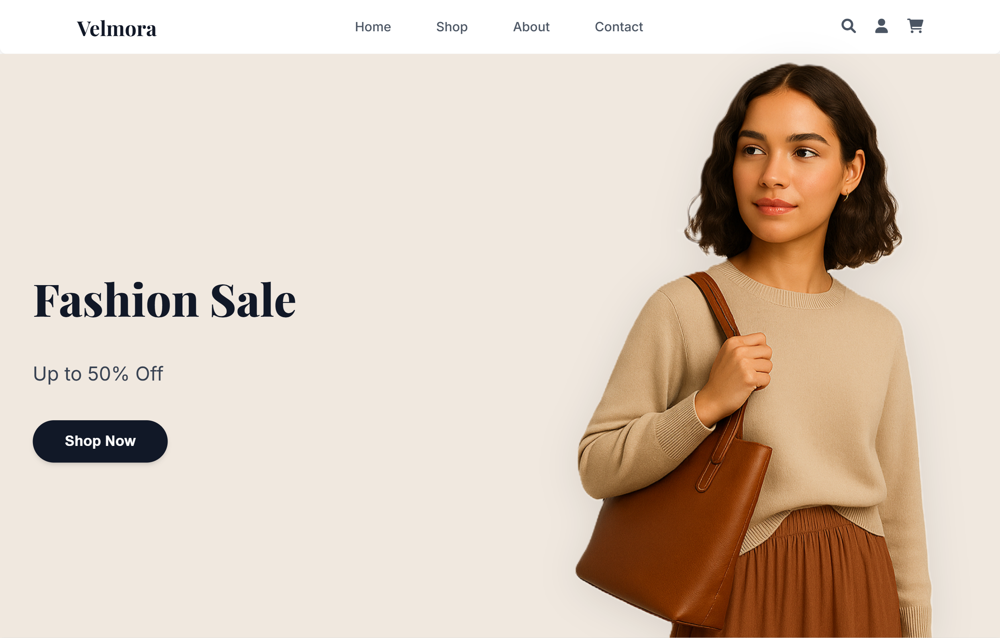

# 🛍️ Velmora — Fashion eCommerce Website

**Velmora** is a clean and modern fashion eCommerce website designed for showcasing stylish clothing with a focus on user experience, product discoverability, and mobile responsiveness.



---

## ✨ Features

- 🖼️ Hero Section with Promotional Banner  
- 🧥 Category Section with Stylish Cards (Men's, Women's, New Arrivals)  
- 🛒 Product Grid – Shop Arrivals with Pricing  
- 💬 Customer Testimonials  
- 📩 Email Newsletter Signup  
- 📦 Footer with Company Info, Help, Socials, and Payment Methods  

---

## 💻 Tech Stack

- **HTML5**
- **CSS3**
- **JavaScript (optional interaction enhancements)**
- **Responsive Design (Flexbox & Media Queries)**

---

## 📁 Folder Structure

```bash
📦 velmora-fashion-store/
 ┣ 📂 css/                # All CSS files
 ┣ 📂 img/                # Image assets (products, UI, etc.)
 ┣ 📂 js/                 # JavaScript files
 ┣ 📄 index.html          # Homepage
 ┣ 📄 Shop.html           # Product listings page
 ┣ 📄 Product.html        # Single product details page
 ┣ 📄 cart.html           # Shopping cart page
 ┣ 📄 Contact.html        # Contact form page
 ┗ 📄 README.md           # Project documentation (this file)
